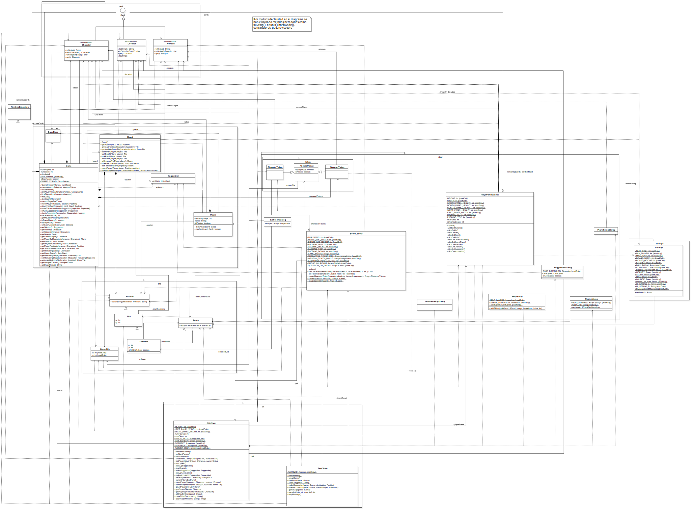
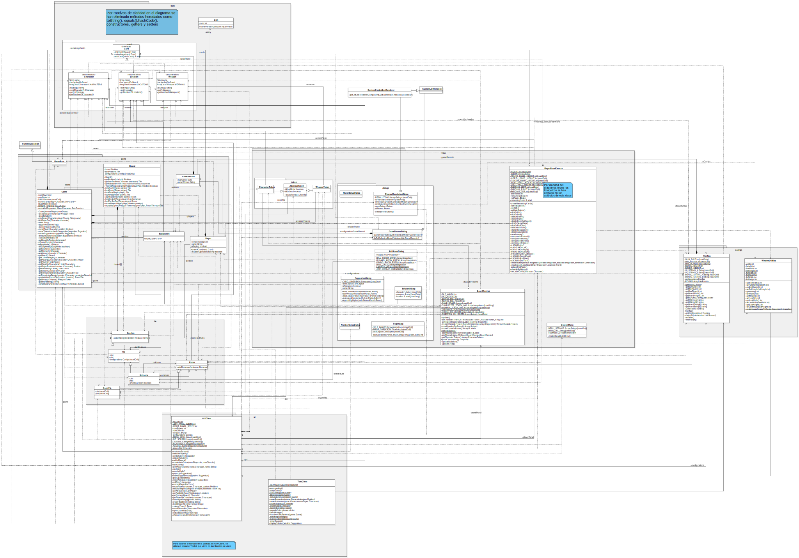

# Cluedo

The application comprising this repository corresponds to an offline version of the well-known board game Cluedo. Implemented with java swing.

Before running the application, you can choose between two game modes.
The first mode consists of a text command version of the game as in early computer games. The second game mode consists of a graphical version of the game adjustable to the monitor screen.

With different characters, the player's goal is to find out who committed the murder, with which weapon and in which room of the entire mansion. In addition, the game features a coin system to modify the classic game dynamics and a game history to see the solutions over time and who won each game.

For the more technical users, this document provides the class diagrams and UML packages that have been used in the development of this application.

## Original version

## Maintenance version

## Evolution Version

Application developed by the following members of group 7 in the subject Software Evolution and Adaptation [Universidad Rey Juan Carlos 2021](https://www.urjc.es/).

| Full Name | Corporative email | Github nickname |
| - | - | - |
| Jorge Adame Prudencio | j.adame.2018@alumnos.urjc.es | [Jorge-ap](https://github.com/jorge-ap) |
| José Luis Toledano Díaz | jl.toledano.2018@alumnos.urjc.es | [jolutoher18](https://github.com/jolutoher18) |
| Jesús Sebastián Tocas Atarama | js.tocas.2018@alumnos.urjc.es | [Mrjesusland](https://github.com/mrjesuland) |
| Alberto Pérez Pérez | a.perezpe.2018@alumnos.urjc.es | [C0nf1cker](https://github.com/C0nf1cker) |

Fork of the FunnyHector project to be used as a basis for EAS practice.
